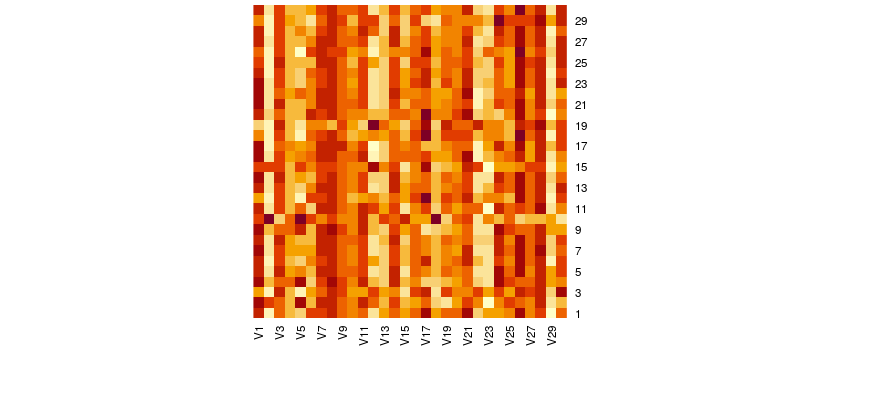
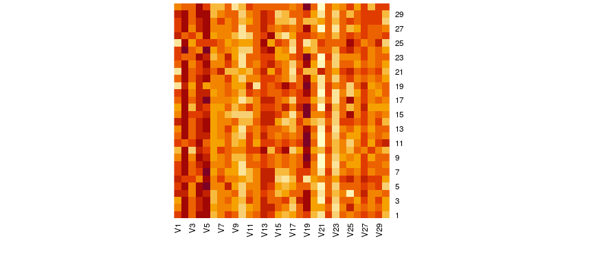

# Multisample Evaluation

The code used to generate the data/results shown here is from commit
`8704d02ba2a1c770d456c39a787c3df48050a182`.

### My Setup

For my setup I am running two Intel Sandy Bridge CPUs (Xeon E5-2670) with
hyperthreading disabled to avoid any possible effects there. I set the
`isolcpus` flag on my kernel to `0,1,2,3,4,5,6,7,8,9,10,11` to prevent the
scheduler from placing anything on those cores so I could later use them
for benchmarking without running into any effects produced by the process
scheduler.

Using `cpupower` I set the clock speed of all the cores to 1200MHz to
avoid any possible benchmarking artifacts from automatic clock frequency
scaling.

### Running the experiments

I collected all of my data by using two multi-sample tests with data created
from the `nbody.c` script with all functions inlined to avoid having to deal
with effects from function calls (setting `-DALWAYS_INLINE` in the compiler
invocation). After starting the docker image present in the repositorr
(make sure to start it with the instructions present in `README.md`,
particularly noting the `--privileged` flag in the `docker run`
invocation), we can start collecting data from within the container.
First, set up some environment variables:

```bash
export EXTRA_FLAGS=-DALWAYS_INLINE
export THREAD_COUNT=12
```

I chose `THREAD_COUNT` to be 12 given that I set `isolcpus` to isolate
the first 12 cores that I have. Then, the actual data collection:

```bash
mkdir /testing-multiple
cd /testing-multiple
/regalloc-testing/scripts/multiple/test_multiple.sh /regalloc-testing/benchmarks/nbody.c
mkdir /testing-multiple2
cd /testing-multiple2
/regalloc-testing/scripts/multiple/test_multiple.sh /regalloc-testing/benchmarks/nbody.c
```

The `test_multiple.sh` invocations will take a long time because by default
they each do 930 iterations of PGO compilation and benchmarking.

### Processing the data

I used several scripts within the repository to process the data. First of all,
it's helpful to have concatenated raw regalloc (raw counts of copies/loads/
stores/etc weighted by MBB frequency scoring data. To grab this:

```bash
cd /testing-multiple
/regalloc-testing/scripts/multiple/combined_regalloc_raw_multiple.sh
/regalloc-testing/scripts/multiple/combined_regalloc.sh test-combined.txt test-combined.txt
cd /testing-multiple2
/regalloc-testing/scripts/multiple/combined_regalloc_raw_multiple.sh
/regalloc-testing/scripts/multiple/combined_regalloc.sh test-combined.txt test-combined.txt
```

Then we can fit weights to the first sample:

```bash
cd /testing-multiple
python3 /regalloc-testing/scripts/fit_weights.py --input_file=./test-combined.txt
```

Which gives the following with what I ended up with:

```
Multivariable regression coefficients:[ 0.1514095   0.22855899 -0.56732352 -0.13465734  0.        ]
Multivariable regression intercept:2023054089.4567916
Normalized coefficients:[1.0, 1.5095419411083808, -3.7469479081565433, -0.8893585852276341, 0.0]
Unadjusted R^2 value:0.1317648313848896
Post regression polarity correct:671
Post regression average difference:0.016195655093246063
```

Fitting weights to the second sample:

```bash
cd /testing-multiple2
python3 /regalloc-testing/scripts/fit_weights.py --input_file=./test-combined.txt
```

results in the following with what I got:

```
Multivariable regression coefficients:[0.80959483 0.39649935 0.47888509 0.49964127 0.        ]
Multivariable regression intercept:1209410464.6733084
Normalized coefficients:[0.9999999999999999, 0.4897503468356181, 0.591512040865649, 0.617149773503729, 0.0]
Unadjusted R^2 value:0.3691650827417813
Post regression polarity correct:871
Post regression average difference:0.027770976493531475
```

Comparing the normalized coefficients, we can see that they're quite different,
and also not really what would be expected (especially for the second run, 
copies being way more expensive than loads? Stores also being more expensive
than loads?).

To validate these findings and make sure they we aren't being susceptible to
random noise and run to run variations, we should also make sure that some of
the individual samples within the sample groups are repeatable to a reasonable
degree. There is tooling in this repository to do this. For example, let's
check the first and last iteration of each sample group:

```bash
mkdir /testing-multiple-control && cd /testing-multiple-control
mkdir group1-iteration1 && cd group1-iteration1
/regalloc-testing/scripts/test_file_existing_compiles.sh /testing-multiple/iteration-1
cd ..
mkdir group1-iteration30 && cd group1-iteration30
/regalloc-testing/scripts/test_file_existing_compiles.sh /testing-multiple/iteration-30
cd ..
mkdir group2-iteration1 && cd group2-iteration1
/regalloc-testing/scripts/test_file_existing_compiles.sh /testing-multiple2/iteration-1
cd ..
mkdir group2-iteration30 && cd group2-iteration30
/regalloc-testing/scripts/test_file_existing_compiles.sh /testing-multiple2/iteration-30
```

Now, let's look at the outputs from each of these and compare them to the
original samples:

For `group1-iteration1`:

```bash
cd /testing-multiple-control/group1-iteration1
/regalloc-testing/scripts/combined_regalloc_raw.sh test-combined.sh
python3 /regalloc-testing/scripts/fit_weights.py --input_file=test-combined.txt
```

Which results in:
```
Multivariable regression coefficients:[ 0.10237747  0.49548383 -0.9866447   0.75451635  0.        ]
Multivariable regression intercept:1929525244.1100466
Normalized coefficients:[1.0, 4.839773907955084, -9.63732213881887, 7.369944949764378, 0.0]
Unadjusted R^2 value:0.3036027695259891
Post regression polarity correct:20
Post regression average difference:0.014179073681918031
```

Compared to the original in the sample group:

```bash
python3 /regalloc-testing/scripts/fit_weights.py --input_file=/testing-multiple/iteration-1/test-combined.txt
```

Which results in:

```
Multivariable regression coefficients:[ 0.1133384   0.66932778 -1.10976041  0.49018797  0.        ]
Multivariable regression intercept:1790207385.355023
Normalized coefficients:[1.0, 5.905569561275844, -9.791566171780042, 4.324994785535641, 0.0]
Unadjusted R^2 value:0.26119049654116866
Post regression polarity correct:24
Post regression average difference:0.015891405727666008
```

As we can see, the values don't line up perfectly (and definitely line up a lot
worse than what I would like), but the values are a lot closer to each other
than what we would expect/what we see in sample to sample differences. I'm
going to include data for the other three comparison tests in a truncated
format since the commands are the exact same (the new control test output
comes first and the original sample output is second):

For `group1-iteration30`:

```
Multivariable regression coefficients:[ 0.26221871  0.5859754  -1.4855566  -1.11857495  0.        ]
Multivariable regression intercept:2068245307.725257
Normalized coefficients:[1.0, 2.2346818705869875, -5.665334039856376, -4.265809018278413, 0.0]
Unadjusted R^2 value:0.4565897459920699
Post regression polarity correct:18
Post regression average difference:0.007955393997135952
```

```
Multivariable regression coefficients:[ 0.26668226  0.48945733 -1.06730069 -0.18985471  0.        ]
Multivariable regression intercept:1904034233.253926
Normalized coefficients:[1.0, 1.8353576160365521, -4.002143482605114, -0.7119135099919597, 0.0]
Unadjusted R^2 value:0.35040617422008746
Post regression polarity correct:23
Post regression average difference:0.0085326127035947
```

For `group2-iteration1`:

```
Multivariable regression coefficients:[1.02194486 0.14512875 0.57642976 2.70950706 0.        ]
Multivariable regression intercept:1120720407.0325546
Normalized coefficients:[1.0, 0.14201231307119322, 0.5640517248876316, 2.6513241281366846, 0.0]
Unadjusted R^2 value:0.7286189600075257
Post regression polarity correct:25
Post regression average difference:0.014554374734731071
```

```
Multivariable regression coefficients:[1.08056092 0.10422116 0.46206789 2.6210175  0.        ]
Multivariable regression intercept:1142988138.4027019
Normalized coefficients:[1.0, 0.09645097690115961, 0.4276185472445662, 2.4256082672147614, 0.0]
Unadjusted R^2 value:0.750051603451299
Post regression polarity correct:25
Post regression average difference:0.013949799248037053
```

For `group2-iteration30`:

```
Multivariable regression coefficients:[ 0.5298814   0.6107433   0.48008735 -1.06823167  0.        ]
Multivariable regression intercept:1296206445.15168
Normalized coefficients:[1.0, 1.152603758079358, 0.9060279270906135, -2.015982552197673, 0.0]
Unadjusted R^2 value:0.4195753152439843
Post regression polarity correct:25
Post regression average difference:0.012802122755349813
```

```
Multivariable regression coefficients:[ 0.49508183  0.54261693  0.43054614 -0.70382139  0.        ]
Multivariable regression intercept:1343645469.9878192
Normalized coefficients:[1.0, 1.0960146415822214, 0.8696464264905663, -1.4216263840274397, 0.0]
Unadjusted R^2 value:0.36608785956622414
Post regression polarity correct:24
Post regression average difference:0.014373357256543788
```

So the repeatability of all these numbers is alright, but definitely not
perfect. The results for repeating a sample are still significantly more
similar than the results for two different samples, and the model from one
repeat should perform similarly well on another repeat (maybe provide some
analysis to back up this claim?).

Now, let's look at how the optimal linear model from one sample group works
on the other sample group and how a combined model fares on both of the
individual samples.

Getting the optimal coefficients for the first sample group and testing it
on the second sample group:

```bash
cd /testing-multiple
python3 /regalloc-testing/scripts/fit_weights.py --input_file=test-combined.txt --output=cofintnolbr
# Output of the above is 0.1514095023746417 0.22855899411687064 -0.5673235181976869 -0.13465734082193145 0.0 2023054089.4567916
cd /testing-multiple2
python3 /regalloc-testing/scripts/evaluate_weights.py 0.1514095023746417 0.22855899411687064 -0.5673235181976869 -0.13465734082193145 0.0 2023054089.4567916 test-combined.txt
```

Which gives the following output:

```
polarity correct:903/929
average difference:0.04282104956813861
```

Going in the reverse direction:
```bash
cd /testing-multiple2
python3 /regalloc-testing/scripts/fit_weights.py --input_file=test-combined.txt --output=cofintnolbr
# Output of the above is 0.8095948290842067 0.3964993483403132 0.4788850896258754 0.49964126539910836 0.0 1209410464.6733084
cd /testing-multiple
python3 /regalloc-testing/scripts/evaluate_weights.py 0.8095948290842067 0.3964993483403132 0.4788850896258754 0.49964126539910836 0.0 1209410464.6733084 test-combined.txt
```

Which gives the following output:
```
polarity correct:311/929
average difference:0.03317628639902063
```

And then the combined model:
```bash
cd /
cat /testing-multiple/test-combined.txt > test-combined.txt
cat /testing-multiple2/test-combined.txt >> test-ccombined.txt
python3 /regalloc-testing/scripts/fit_weights.py --input_file=test-combined.txt --output=cofintnolbr
# Output of the above is 0.3039412698271154 0.3146090443909967 -0.5151634266701539 -0.007120739834068272 0.0 1767102673.1120062
cd /testing-multiple
python3 /regalloc-testing/scripts/evaluate_weights.py 0.3039412698271154 0.3146090443909967 -0.5151634266701539 -0.007120739834068272 0.0 1767102673.1120062 test-combined.txt
cd /testing-multiple2
python3 /regalloc-testing/scripts/evaluate_weights.py 0.3039412698271154 0.3146090443909967 -0.5151634266701539 -0.007120739834068272 0.0 1767102673.1120062 test-combined.txt
```

Output from `evaluate_weights.py` in `/testing-multiple`:

```
polarity correct:538/929
average difference:0.01858380050695964
```

Output from `evaluate_weights.py` in `/testing-multiple2`:

```
polarity correct:906/929
average difference:0.03757900624883771
```

We can also look at heat maps of each sample group to see how the model
produced from an individual sample performs on all the other samples in the
sample group. For `/testing-multiple`:

```bash
cd /testing-multiple
/regalloc-testing/scripts/multiple/fit_weights_extraction.sh cofintnolbr cofints.txt
PYTHONPATH="/regalloc-testing/scripts" python3 /regalloc-testing/scripts/multiple/sample_weight_performance_matrix.py --params_file=cofints.txt --is_csv=true
```

This results in the following matrix (the ith row is the model produced by the
ith sample within the group and the jth column is the performance of the model
on the jth sample as indicated by the metric number of binaries/benchmarks where
the polarity is correct over the the total number of binaries/benchmarks):

```
0.80,0.17,0.67,0.40,0.33,0.73,0.73,0.77,0.63,0.57,0.67,0.20,0.43,0.60,0.50,0.63,0.90,0.47,0.60,0.63,0.87,0.27,0.50,0.50,0.53,0.90,0.57,0.73,0.10,0.63
0.87,0.73,0.63,0.43,0.90,0.43,0.77,0.77,0.60,0.53,0.80,0.60,0.43,0.73,0.40,0.50,0.60,0.30,0.27,0.47,0.73,0.53,0.07,0.57,0.70,0.67,0.57,0.80,0.27,0.37
0.50,0.17,0.80,0.43,0.23,0.47,0.63,0.77,0.70,0.47,0.50,0.70,0.47,0.57,0.27,0.70,0.77,0.30,0.70,0.53,0.57,0.67,0.47,0.70,0.50,0.80,0.67,0.80,0.37,0.83
0.83,0.30,0.57,0.53,0.80,0.27,0.67,0.77,0.63,0.50,0.73,0.33,0.23,0.70,0.33,0.50,0.20,0.23,0.30,0.40,0.53,0.20,0.13,0.83,0.67,0.57,0.53,0.73,0.40,0.47
0.77,0.17,0.73,0.40,0.50,0.30,0.73,0.77,0.63,0.57,0.67,0.20,0.27,0.73,0.20,0.57,0.47,0.30,0.57,0.53,0.57,0.20,0.20,0.83,0.63,0.83,0.53,0.80,0.40,0.70
0.80,0.17,0.67,0.40,0.33,0.57,0.73,0.77,0.63,0.57,0.70,0.50,0.30,0.70,0.40,0.63,0.77,0.43,0.57,0.60,0.77,0.37,0.20,0.67,0.53,0.90,0.60,0.77,0.13,0.73
0.83,0.17,0.70,0.40,0.43,0.47,0.73,0.77,0.63,0.53,0.70,0.17,0.30,0.67,0.37,0.60,0.50,0.37,0.50,0.47,0.73,0.17,0.20,0.73,0.57,0.83,0.57,0.80,0.30,0.63
0.77,0.17,0.77,0.40,0.37,0.37,0.77,0.77,0.63,0.60,0.67,0.20,0.33,0.77,0.30,0.57,0.53,0.33,0.60,0.53,0.63,0.23,0.23,0.80,0.50,0.87,0.60,0.80,0.27,0.73
0.83,0.30,0.60,0.53,0.73,0.30,0.70,0.77,0.63,0.50,0.70,0.33,0.23,0.67,0.37,0.53,0.20,0.27,0.30,0.43,0.57,0.20,0.13,0.83,0.67,0.57,0.53,0.73,0.40,0.43
0.63,0.83,0.27,0.57,0.83,0.63,0.50,0.63,0.50,0.47,0.67,0.33,0.60,0.57,0.70,0.40,0.43,0.80,0.27,0.53,0.60,0.23,0.47,0.33,0.53,0.27,0.37,0.33,0.43,0.20
0.73,0.30,0.67,0.40,0.60,0.37,0.77,0.73,0.63,0.57,0.77,0.70,0.47,0.70,0.27,0.53,0.70,0.37,0.60,0.47,0.63,0.63,0.17,0.73,0.60,0.67,0.60,0.80,0.30,0.57
0.50,0.17,0.73,0.40,0.20,0.70,0.73,0.77,0.63,0.43,0.50,0.53,0.43,0.60,0.47,0.67,0.93,0.43,0.67,0.60,0.77,0.43,0.57,0.57,0.43,0.87,0.63,0.77,0.20,0.73
0.77,0.17,0.70,0.40,0.27,0.53,0.77,0.77,0.63,0.53,0.70,0.17,0.27,0.73,0.43,0.60,0.60,0.33,0.53,0.57,0.67,0.20,0.37,0.70,0.57,0.83,0.60,0.77,0.23,0.77
0.83,0.17,0.80,0.40,0.43,0.33,0.73,0.77,0.63,0.57,0.67,0.27,0.30,0.77,0.33,0.57,0.60,0.37,0.60,0.53,0.67,0.23,0.20,0.80,0.60,0.87,0.60,0.80,0.27,0.63
0.70,0.67,0.70,0.40,0.73,0.57,0.73,0.73,0.63,0.57,0.57,0.83,0.53,0.70,0.23,0.57,0.87,0.33,0.43,0.47,0.80,0.67,0.10,0.50,0.50,0.57,0.70,0.67,0.20,0.47
0.83,0.17,0.67,0.43,0.50,0.60,0.73,0.77,0.63,0.57,0.73,0.13,0.30,0.63,0.57,0.57,0.67,0.43,0.47,0.60,0.83,0.13,0.33,0.53,0.60,0.80,0.47,0.73,0.20,0.53
0.77,0.13,0.57,0.53,0.43,0.47,0.70,0.73,0.70,0.53,0.67,0.03,0.27,0.60,0.53,0.57,0.33,0.33,0.47,0.60,0.57,0.13,0.40,0.73,0.53,0.77,0.40,0.70,0.37,0.63
0.57,0.17,0.73,0.40,0.20,0.60,0.70,0.77,0.63,0.43,0.47,0.57,0.47,0.63,0.37,0.67,0.90,0.43,0.70,0.67,0.70,0.43,0.53,0.57,0.40,0.97,0.60,0.77,0.20,0.73
0.37,0.23,0.77,0.43,0.30,0.57,0.53,0.40,0.67,0.50,0.37,0.87,0.60,0.50,0.33,0.63,0.83,0.37,0.73,0.60,0.60,0.77,0.57,0.57,0.43,0.73,0.70,0.80,0.43,0.70
0.80,0.37,0.63,0.43,0.40,0.80,0.73,0.77,0.63,0.60,0.53,0.43,0.43,0.63,0.63,0.60,0.93,0.57,0.53,0.73,0.87,0.30,0.43,0.30,0.53,0.87,0.53,0.70,0.07,0.57
0.83,0.17,0.73,0.40,0.37,0.50,0.73,0.77,0.63,0.57,0.70,0.17,0.30,0.67,0.40,0.60,0.60,0.43,0.50,0.60,0.70,0.13,0.33,0.70,0.57,0.83,0.53,0.80,0.27,0.63
0.80,0.17,0.63,0.40,0.60,0.50,0.77,0.77,0.63,0.53,0.70,0.20,0.30,0.77,0.53,0.53,0.57,0.40,0.47,0.57,0.80,0.13,0.27,0.60,0.60,0.77,0.40,0.77,0.23,0.47
0.87,0.17,0.70,0.40,0.27,0.57,0.73,0.77,0.63,0.50,0.70,0.20,0.33,0.67,0.43,0.67,0.83,0.40,0.67,0.53,0.80,0.30,0.37,0.60,0.43,0.90,0.60,0.77,0.23,0.77
0.83,0.17,0.67,0.40,0.33,0.63,0.70,0.77,0.63,0.57,0.70,0.23,0.33,0.73,0.43,0.63,0.80,0.47,0.63,0.53,0.83,0.27,0.30,0.63,0.50,0.87,0.60,0.77,0.17,0.73
0.73,0.17,0.77,0.40,0.37,0.37,0.77,0.77,0.63,0.40,0.73,0.50,0.30,0.73,0.30,0.67,0.73,0.37,0.60,0.60,0.70,0.37,0.30,0.73,0.50,0.87,0.67,0.77,0.27,0.77
0.60,0.17,0.70,0.40,0.10,0.70,0.77,0.73,0.67,0.43,0.57,0.17,0.40,0.50,0.50,0.63,0.87,0.47,0.63,0.57,0.67,0.30,0.63,0.57,0.47,0.90,0.57,0.73,0.30,0.77
0.80,0.17,0.67,0.40,0.37,0.53,0.73,0.77,0.63,0.60,0.67,0.20,0.33,0.73,0.40,0.57,0.67,0.43,0.53,0.53,0.73,0.20,0.27,0.70,0.57,0.87,0.57,0.73,0.17,0.73
0.80,0.17,0.70,0.40,0.53,0.37,0.73,0.77,0.63,0.53,0.77,0.60,0.30,0.77,0.33,0.53,0.67,0.40,0.57,0.53,0.73,0.40,0.23,0.80,0.63,0.83,0.60,0.80,0.20,0.63
0.53,0.17,0.67,0.43,0.37,0.23,0.57,0.70,0.67,0.37,0.63,0.67,0.30,0.60,0.27,0.63,0.33,0.20,0.60,0.50,0.53,0.53,0.40,0.83,0.67,0.63,0.67,0.77,0.47,0.73
0.83,0.17,0.67,0.40,0.40,0.47,0.73,0.77,0.63,0.60,0.67,0.20,0.33,0.70,0.33,0.60,0.67,0.43,0.57,0.53,0.77,0.27,0.20,0.73,0.57,0.93,0.60,0.80,0.17,0.77
```

Which looks like the following in heatmap form:



Doing the same for `/testing-multiple2`:

```bash
cd /testing-multiple2
/regalloc-testing/scripts/multiple/fit_weights_extraction.sh cofintnolbr cofints.txt
PYTHONPATH="/regalloc-testing/scripts" python3 /regalloc-testing/scripts/multiple/sample_weight_performance_matrix.py --params_file=cofints.txt --is_csv=true
```

The outputted matrix:

```
0.83,0.97,0.70,0.93,1.00,0.50,0.63,0.80,0.73,0.40,0.67,0.70,0.90,0.83,0.60,0.50,0.57,0.73,0.77,0.47,0.33,0.77,0.43,0.73,0.67,0.70,0.80,0.73,0.83,0.50
0.73,0.97,0.80,0.90,1.00,0.63,0.70,0.67,0.63,0.47,0.63,0.70,0.87,0.87,0.80,0.73,0.47,0.77,1.00,0.63,0.63,0.80,0.43,0.73,0.93,0.67,0.80,0.73,0.77,0.60
0.63,0.97,0.73,0.87,0.97,0.57,0.70,0.77,0.60,0.57,0.80,0.70,0.87,0.73,0.77,0.83,0.53,0.87,1.00,0.63,0.37,0.83,0.47,0.77,0.77,0.63,0.80,0.70,0.83,0.63
0.87,0.93,0.63,0.97,0.90,0.43,0.60,0.63,0.70,0.30,0.73,0.60,0.80,0.70,0.43,0.50,0.67,0.67,1.00,0.57,0.17,0.73,0.40,0.63,0.13,0.67,0.90,0.60,0.57,0.70
0.83,0.97,0.70,0.93,1.00,0.67,0.67,0.87,0.63,0.47,0.70,0.70,0.90,0.83,0.63,0.53,0.57,0.73,0.77,0.50,0.33,0.77,0.47,0.77,0.73,0.73,0.80,0.73,0.80,0.47
0.87,0.73,0.70,0.60,0.93,0.60,0.73,0.53,0.60,0.43,0.40,0.60,0.83,0.83,0.27,0.20,0.37,0.77,0.23,0.43,0.57,0.67,0.43,0.73,0.80,0.67,0.80,0.70,0.70,0.47
0.80,0.97,0.77,0.83,1.00,0.63,0.73,0.63,0.63,0.40,0.57,0.70,0.90,0.90,0.53,0.57,0.67,0.83,0.80,0.70,0.37,0.80,0.47,0.70,0.77,0.70,0.80,0.67,0.73,0.73
0.83,0.97,0.77,0.93,0.97,0.67,0.67,0.73,0.63,0.40,0.80,0.73,0.87,0.80,0.70,0.80,0.70,0.80,1.00,0.67,0.27,0.80,0.43,0.73,0.60,0.63,0.83,0.73,0.77,0.67
0.73,0.97,0.73,0.93,0.90,0.67,0.70,0.80,0.57,0.60,0.80,0.73,0.83,0.80,0.73,0.77,0.70,0.77,1.00,0.80,0.30,0.77,0.53,0.67,0.70,0.63,0.83,0.63,0.80,0.77
0.43,0.90,0.37,0.87,0.77,0.57,0.73,0.70,0.60,0.60,0.80,0.73,0.90,0.47,0.77,0.90,0.37,0.57,0.93,0.57,0.47,0.80,0.50,0.60,0.50,0.70,0.63,0.77,0.63,0.50
0.77,0.73,0.77,0.93,0.73,0.60,0.60,0.70,0.53,0.57,0.80,0.60,0.77,0.77,0.70,0.80,0.70,0.77,1.00,0.70,0.23,0.73,0.50,0.67,0.43,0.63,0.83,0.60,0.80,0.90
0.77,0.97,0.77,0.90,0.93,0.67,0.70,0.80,0.60,0.53,0.83,0.73,0.90,0.80,0.73,0.77,0.70,0.77,1.00,0.70,0.30,0.80,0.53,0.77,0.67,0.63,0.83,0.70,0.80,0.70
0.73,0.97,0.77,0.93,0.97,0.63,0.70,0.83,0.63,0.43,0.80,0.73,0.87,0.80,0.80,0.70,0.60,0.77,1.00,0.77,0.37,0.83,0.47,0.70,0.77,0.63,0.80,0.67,0.80,0.77
0.87,0.97,0.70,0.93,1.00,0.53,0.67,0.63,0.73,0.43,0.47,0.70,0.90,0.93,0.53,0.33,0.50,0.80,0.67,0.43,0.37,0.73,0.40,0.77,0.80,0.73,0.80,0.67,0.77,0.50
0.67,0.97,0.80,0.80,0.90,0.60,0.70,0.57,0.50,0.50,0.50,0.70,0.87,0.87,0.80,0.70,0.43,0.77,1.00,0.67,0.67,0.80,0.47,0.73,0.93,0.67,0.80,0.67,0.73,0.67
0.60,0.93,0.57,0.87,0.80,0.60,0.63,0.77,0.57,0.67,0.83,0.67,0.80,0.80,0.73,0.87,0.70,0.87,1.00,0.73,0.30,0.87,0.53,0.73,0.53,0.67,0.90,0.63,0.63,0.63
0.77,0.97,0.73,0.90,1.00,0.70,0.70,0.67,0.63,0.47,0.57,0.70,0.87,0.87,0.73,0.67,0.53,0.80,0.80,0.63,0.50,0.77,0.47,0.73,0.93,0.67,0.80,0.67,0.77,0.67
0.83,0.97,0.67,0.93,0.90,0.63,0.67,0.73,0.67,0.50,0.87,0.73,0.83,0.80,0.73,0.83,0.73,0.83,1.00,0.73,0.23,0.87,0.37,0.70,0.47,0.63,0.83,0.70,0.63,0.73
0.33,0.90,0.50,0.83,0.57,0.60,0.60,0.70,0.50,0.57,0.83,0.33,0.80,0.73,0.77,0.93,0.77,0.73,1.00,0.67,0.30,0.80,0.60,0.70,0.37,0.70,0.83,0.53,0.63,0.73
0.77,0.97,0.80,0.90,1.00,0.73,0.70,0.83,0.63,0.50,0.67,0.70,0.87,0.87,0.80,0.70,0.47,0.80,1.00,0.63,0.40,0.77,0.47,0.80,0.83,0.67,0.80,0.70,0.77,0.63
0.30,0.97,0.67,0.80,0.83,0.67,0.83,0.43,0.50,0.57,0.47,0.73,0.87,0.57,0.77,0.63,0.30,0.80,0.50,0.50,0.83,0.73,0.57,0.77,0.90,0.70,0.80,0.70,0.77,0.50
0.77,0.97,0.73,0.87,1.00,0.73,0.70,0.83,0.67,0.40,0.80,0.73,0.87,0.90,0.80,0.70,0.50,0.80,1.00,0.60,0.37,0.77,0.47,0.80,0.80,0.63,0.80,0.70,0.77,0.60
0.80,0.77,0.77,0.93,0.90,0.57,0.70,0.87,0.63,0.40,0.77,0.77,0.83,0.80,0.60,0.63,0.73,0.80,1.00,0.73,0.30,0.80,0.50,0.67,0.70,0.70,0.83,0.70,0.77,0.77
0.77,0.97,0.73,0.67,0.97,0.60,0.73,0.67,0.60,0.47,0.43,0.70,0.87,0.90,0.60,0.63,0.37,0.77,0.60,0.50,0.70,0.73,0.50,0.77,0.87,0.73,0.80,0.63,0.73,0.60
0.20,0.90,0.47,0.73,0.70,0.70,0.63,0.43,0.57,0.50,0.43,0.67,0.87,0.50,0.77,0.63,0.30,0.70,0.23,0.37,0.77,0.63,0.60,0.67,0.90,0.70,0.57,0.67,0.83,0.30
0.83,0.73,0.80,0.63,0.90,0.60,0.67,0.63,0.53,0.40,0.47,0.70,0.80,0.90,0.53,0.40,0.60,0.80,0.77,0.70,0.63,0.73,0.50,0.73,0.77,0.73,0.80,0.70,0.70,0.80
0.83,0.97,0.70,0.93,0.97,0.67,0.67,0.70,0.77,0.40,0.80,0.73,0.90,0.80,0.67,0.80,0.70,0.80,1.00,0.67,0.27,0.80,0.40,0.73,0.57,0.63,0.83,0.73,0.80,0.67
0.83,0.97,0.70,0.90,1.00,0.63,0.77,0.63,0.70,0.43,0.53,0.67,0.90,0.83,0.43,0.40,0.33,0.73,0.40,0.40,0.57,0.67,0.43,0.67,0.77,0.67,0.80,0.80,0.83,0.37
0.87,0.97,0.70,0.97,0.97,0.47,0.60,0.73,0.73,0.37,0.57,0.67,0.87,0.83,0.37,0.43,0.67,0.70,0.77,0.50,0.23,0.73,0.37,0.70,0.47,0.67,0.83,0.77,0.80,0.43
0.70,0.73,0.77,0.93,0.83,0.60,0.60,0.77,0.47,0.60,0.80,0.73,0.77,0.77,0.73,0.73,0.70,0.77,1.00,0.73,0.37,0.73,0.63,0.70,0.80,0.63,0.80,0.60,0.80,0.80
```

The heat map:



Also checking to see how many of the programs are unique using the checksums
created during the `pgo_compile.sh` process:

```bash
cd /testing-multiple
/regalloc-testing/scripts/multiple/combined_regalloc.sh checksums.txt checksums.txt
cat checksums.txt | grep -o "^\w*" | uniq | wc -l
# output is 930 out of a possible high of 930
cd /testing-multiple2
/regalloc-testing/scripts/multiple/combined_regalloc.sh
cat checksums.txt | grep -o "^\w*" | uniq | wc -l
# output is 827 out of a possible high of 930
cd /
cat /testing-multiple/checksums.txt > checksums.txt
cat /testing-multiple2/checksums.txt >> checksums.txt
cat checksums.txt | grep -o "^\w*" | uniq | wc -l
# output is 1757 out of a possible high of 1860
```

So not all of the binaries are unique, but we have a pretty wide selection
of unique binaries.

### Discussion

Give the heatmaps shown and the performance in one direction on the sample
groups (going from the model produced with `testing-multiple2` to evaluting
it on `testing-multiple`), it seems like one model isn't necessarily that
applicable to another sample even given a fairly large training set. This
seems to imply that there is some large variable that is getting missed
in the inputs to the cost model that is also contributing significantly
to the variability in the data.

### Limitations

One of the metrics that I'm using here in evaluating models, particularly
the average difference between the predicted percent speedup/slowdown and
the actual speedup/slowdown is not great, because it is dependent pretty
heavily on the intercept of the model, which changes from model to model.
This is something that needs to be looked at in the future and adjusted.
Just looking at the polarity correct and average difference doesn't tell
us *when* the model is wrong though. If the model is wrong when the
slowdown or speedup is significant, that is way worse than if the model
is wrong when the speedup or slowdown is extremely small. Perhaps a
weighted average might be good here?

Within these experiments I was also producing different coefficients
for both stores and loads, but given the nature of these instructions
they have an extremely high degree of colinearity which can interfere
with the linear regression process. This does need to be fixed, but
running a couple quick tests it doesn't seem to impact the conclusions
at all.

### Conclusion

I think it is safe to conclude that the optimal model from sample to sample
varies significantly which implies that there is a major variable we aren't
taking into account. How bad this problem ends up beig in practice while
training ML models is hard to state though.

This also means that the question of whether or not we need to refit
the model for different programs becomes somewhat irrelevant because
it looks like we need to refit the model for every sample (ie
training batch) for optimal performance.

### Future Directions

* Work on better metrics for quantifying how significant this problem is
* Make scripts use adjusted R^2 (won't change conclusions at all, but is
good statistical practice).
* Try and find out what variables we aren't account for (could do a
search by emitting IR/assembly and looking for the fewest number
of lines changed relative to the highest difference between the
predicted and actual speedup).
* Hope that all of this data and my conclusions actually are correct
and aren't just complete crap